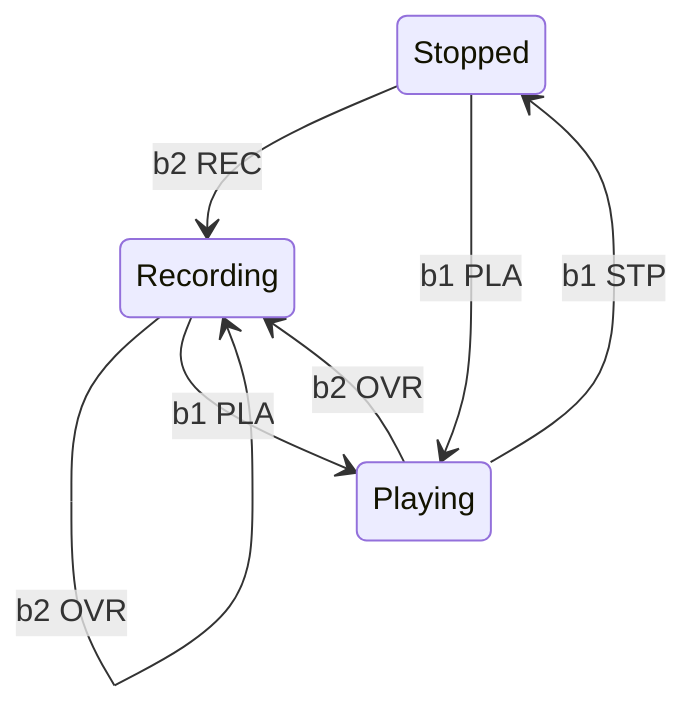

# Tamazaque, json configurable midi controller built with CircuitPython

Tamazaque is a pedal midi controller. The main feature is the json configuration file.

My build uses this hardware:
* OLED screen
* 8 stomp buttons
* 8 rgb neoleds
* 1 clickable rotary controller
* Internal battery
* DIN midi output
* USB midi output
* Expresession pedal input (WIP)

You can build it with just buttons to use as usb midi controller.

## Flexible configuration

* Multiple configuration pages in the same file
* Multiple midi commands in each event
* Press, long press and release events
* Button state events: Pressing the button changes its state, each state has its own midi commands, button label and led color
* Page state events: Pressing a button can change the page state, in each page state the selected buttons have its own midi commands, button label and led color

https://github.com/yeraym/tamazaque_controller_cp/assets/15657/9300e179-c97f-4f25-ac0f-a5f47503e1b4

### Controlling Helix looper with page states

https://github.com/yeraym/tamazaque_controller_cp/assets/15657/437ce06c-3e69-4787-ad2f-32ee27311f39

With two buttons and three states we have this state diagram

The page state remains between page chanes.

https://github.com/yeraym/tamazaque_controller_cp/assets/15657/d9d0d5d9-dbfc-4f12-8cac-32a77c226c4c

## Hardware

* Adafruit Feather RP2040

 ## Software
 
 Adafruit CircuitPython 8.0.5 on 2023-03-31
