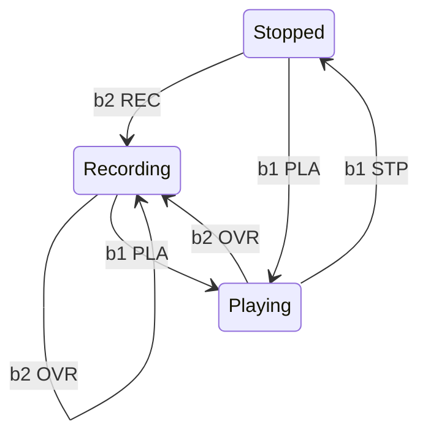

# Tamazaque, json configurable midi controller built with CircuitPython

Tamazaque is a pedal midi controller that sends midi messages over usb. The main feature is the json configuration file. This file defines the number of buttons and their GPIO pins, it also contains the midi messages associated with each button. Each button can send multiple midi messages in each of these events: press, release and long press. The configuration support multiple configuration pages, with each page containing new set of messages associated to the buttons, there is also an internal command to change the active page, this command can be fired by any button event.

You can use it with just a CircuitPython board and some buttons connected to the GPIO pins to send midi commands over usb.

I have built it to use as a pedal midi controller with the following features that are optional, you can modify tamzaque_controller.py to disabled them:

* OLED screen
* 8 rgb neoleds
* 1 clickable rotary controller
* Internal battery
* DIN midi output
* Expresession pedal input (work in progress)

## Flexible configuration

* Multiple configuration pages in the same file
* Multiple midi commands in each event
* Press, long press and release events
* Button state events: Pressing the button changes its state, each state has its own midi commands, button label and led color
* Page state events: Pressing a button can change the page state, in each page state the selected buttons have its own midi commands, button label and led color

[https://github.com/yeraym/tamazaque_controller_cp/assets/15657/9300e179-c97f-4f25-ac0f-a5f47503e1b4](https://github.com/yeraym/tamazaque_controller_cp/assets/15657/8556ee29-081b-4899-830b-929b79d702a5)

### Controlling Helix looper with page states

https://github.com/yeraym/tamazaque_controller_cp/assets/15657/7a66e826-a8ea-418a-8306-beabef41353e

With two buttons and three states we have this state diagram

The page state remains between page chanes.

https://github.com/yeraym/tamazaque_controller_cp/assets/15657/6a2544f6-e760-4b4e-b410-86d34b3e2134

## Hardware

I built it with an Adafruit Feather RP2040 borad.

### Build

I built a little carrier with some male-female long headers and a spot prototyping board to be able to swap the feather with any other compatible one.

You can see in the backside it has two rows which I use for ground a +V connections.

 ## Software
 
 Adafruit CircuitPython 8.0.5 on 2023-03-31

 ### To-Do

 * I need to finish the code for the expression pedal input.
 * It would be nice to build a menu module using the rotary controller to configure some parameters on the fly or select other configuration files
 * I am developing an editor for the configuration files but I'm not sure when it would be finished as I really don't need it
